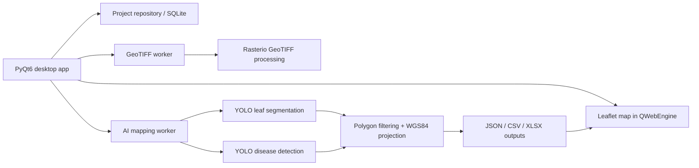
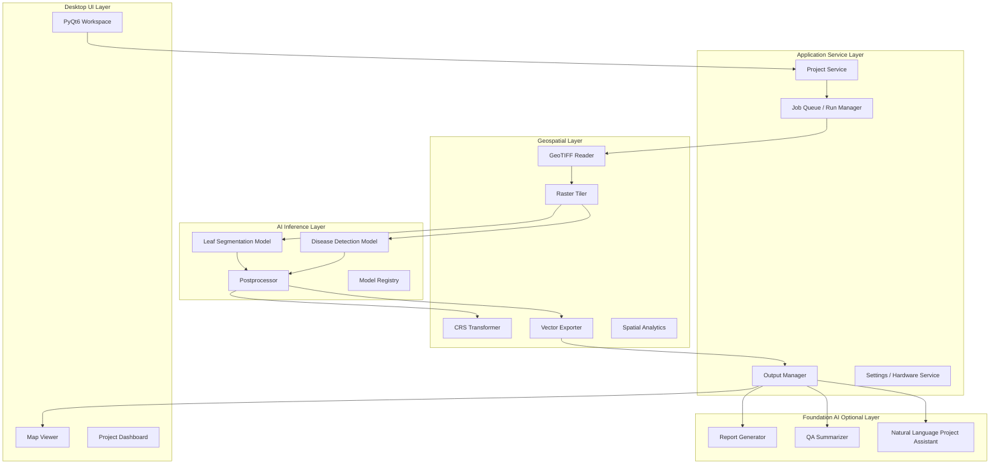
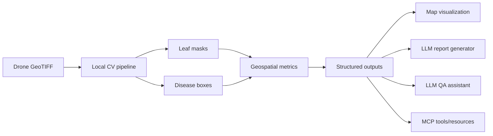
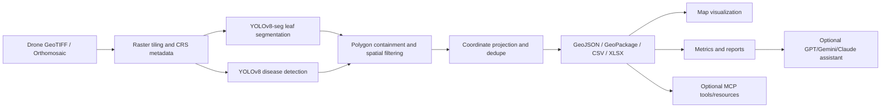

# Musa AI Architecture and AI Workflow Review

Date reviewed: May 22, 2026  
Project: Musa AI Desktop  
Repository path: `F:\OJT\Musa-AI-Desktop`

## Executive Summary

The honest recommendation is clear: do not replace the current YOLOv8 and YOLOv8-seg computer vision pipeline with GPT, Gemini, Claude, or similar multimodal foundation-model APIs for the core disease detection, leaf segmentation, polygon filtering, and geospatial metric workflow.

Foundation models can be useful in Musa AI, but they should augment the system rather than replace the measurement engine. They are good for report generation, workflow assistance, natural-language querying, QA summarization, annotation assistance, and user-facing insight generation. They are not the right primary tool for deterministic, leaf-level, geospatially accurate computer vision over high-resolution drone orthomosaics.

The current system is directionally correct for the problem domain. It uses:

- YOLOv8 for banana disease detection/classification.
- YOLOv8-seg for banana leaf segmentation and geometry analysis.
- Rasterio/GDAL-style GeoTIFF processing.
- Tile-based inference over orthomosaics.
- Polygon containment logic to filter disease detections by leaf geometry.
- WGS84 coordinate projection.
- JSON, CSV, and XLSX exports.
- A PyQt6 desktop interface with Leaflet-based map visualization.
- Local SQLite metadata storage.
- Offline-capable AI processing.

The strongest version of Musa AI is a hybrid architecture:

- Local, deterministic CV models for inference and geospatial measurement.
- Foundation AI models for interpretation, reporting, assistant workflows, and annotation support.
- MCP or API orchestration only around the workflow, not as the high-volume image inference data plane.

## Codebase Evidence

The actual repository is a compact PyQt desktop application with a geospatial AI pipeline. The most important modules are:

- `main.py`: application entry point.
- `banana_mapper/app.py`: application shell, project workflow, GeoTIFF import, AI mapping orchestration, map updates, settings, hardware status, and output management.
- `banana_mapper/detection.py`: core AI mapping pipeline.
- `banana_mapper/geotiff.py`: GeoTIFF loading, CRS validation, reprojection, preview generation, and tile pyramid generation.
- `banana_mapper/worker.py`: QThread workers for GeoTIFF processing, AI mapping, and hardware checks.
- `banana_mapper/map_view.html`: Leaflet-based map renderer.
- `banana_mapper/core/database.py`: SQLite metadata repository.
- `banana_mapper/core/output_manager.py`: managed project output folders.
- `banana_mapper/core/geotiff_cache.py`: GeoTIFF preview cache.
- `banana_mapper/ui/workspace.py`: main GIS workspace UI.
- `RELEASE_AND_DEPLOYMENT_GUIDE.md`: Windows packaging and deployment strategy.

The core inference path in `banana_mapper/detection.py` already implements a real two-model funnel:

1. Open a GeoTIFF with rasterio.
2. Generate overlapping raster tiles.
3. Read up to three image bands per tile.
4. Convert tile data to RGB.
5. Run the leaf model using YOLO.
6. Run the disease model using YOLO.
7. Parse leaf segmentation polygons.
8. Parse disease bounding boxes.
9. Offset tile-local detections into full-raster pixel coordinates.
10. Match disease centers against leaf polygons.
11. Convert raster pixel coordinates to WGS84 latitude/longitude.
12. Deduplicate nearby records by haversine distance.
13. Save JSON, CSV, and XLSX outputs.
14. Optionally write QA diagnostics and disease crops.

That is the correct class of pipeline for drone-based agricultural disease mapping. The system is not simply "an AI chatbot around images"; it is already a geospatial CV application.

## 1. Feasibility Analysis

### Can GPT/Gemini/Claude Replace YOLOv8 and YOLOv8-seg?

Realistically, no. They can imitate parts of the workflow on small examples, but they are not reliable replacements for the current YOLO-based pipeline.

Foundation multimodal models can:

- Describe what appears in an image.
- Identify obvious regions in normal photographs.
- Answer high-level visual questions.
- Produce rough bounding boxes or coordinates when prompted carefully.
- Summarize structured detection outputs.
- Assist with labeling and QA review.

They are not designed to be:

- Deterministic segmentation engines.
- Pixel-accurate polygon extractors.
- Calibrated disease classifiers for a narrow agricultural domain.
- High-throughput orthomosaic processors.
- Offline field-deployable CV inference engines.
- Scientific measurement tools without additional validation.

The main issue is not whether a multimodal LLM can sometimes see disease symptoms. The issue is whether it can consistently and reproducibly output accurate leaf polygons, lesion locations, class labels, confidence values, and geospatially valid measurements across thousands of drone tiles. That is where the API-based approach breaks down.

### Leaf Segmentation

Replacing YOLOv8-seg with a multimodal LLM is not technically sound for production or thesis-grade measurement.

Leaf segmentation requires:

- Consistent object boundaries.
- Pixel-accurate masks.
- Reproducible polygons.
- Stable behavior across lighting, overlap, blur, rotation, altitude, and cultivar variation.
- Quantifiable mAP/mIoU metrics.

Generic multimodal APIs typically return text, approximate coordinates, or descriptions. Even when they provide bounding boxes or coordinate-like outputs, those coordinates may be relative to resized model input rather than the original raster dimensions. Claude's vision documentation explicitly notes that images may be resized and padded, and coordinates must be rescaled client-side. OpenAI's vision documentation also describes model-specific image resizing and patch budgets, and lists precise spatial localization as a known limitation.

For Musa AI, leaf geometry is not cosmetic. The leaf polygon is used to filter disease detections. If the polygon is unstable, every downstream metric is unstable.

### Polygon Extraction

Polygon extraction from foundation models is not appropriate as the primary segmentation method.

Problems:

- Outputs may not be true polygons.
- Vertex order may be inconsistent.
- Self-intersections and invalid geometries are possible.
- Small boundary changes can materially affect disease containment decisions.
- Coordinates may refer to a model-resized image, not the original GeoTIFF tile.
- Repeated calls can produce different outputs.
- There is no native mIoU-style guarantee from the model.

By contrast, YOLOv8-seg produces segmentation masks directly from a trained model. Those masks can be benchmarked, compared against ground truth, exported, and versioned.

### Disease Localization

Disease localization is a stronger fit for custom CV than for foundation model APIs.

Banana disease symptoms in drone imagery may appear as:

- Small lesions.
- Color texture differences.
- Leaf-edge discoloration.
- Blurred patches due to altitude, motion, or stitching.
- Symptoms partially hidden by canopy overlap.
- Disease signatures that vary by lighting, cultivar, stage, and sensor.

Generic models are not trained specifically to distinguish black sigatoka, Panama disease, nutrient stress, shadow, dry tissue, and camera/stitching artifacts at plantation scale. A custom YOLO model trained on local banana plantation imagery is much more defensible.

### Disease Classification

Foundation models can classify obvious examples, but disease classification must be evaluated against a dataset. For the thesis and system, the important question is not "Can GPT describe a diseased leaf?" The important question is:

- What is the class-level precision, recall, and F1 for black sigatoka and Panama disease?
- Does the model confuse disease symptoms with shadows, necrosis, leaf age, and physical damage?
- Does it behave consistently across drone flights?
- Can the same version be frozen for reproducible experiments?
- Can confidence thresholds be calibrated?

YOLO can be evaluated with a fixed validation set. API models can change over time, and their behavior can shift with model updates, safety layers, or provider-side changes.

### Hectare-Level Metrics

Foundation models should not compute hectare-level metrics directly from drone imagery. Hectare-level analytics should be computed by deterministic geospatial code:

- Field boundary polygons.
- Raster ground sampling distance.
- CRS-aware area calculations.
- Detection counts per hectare.
- Disease density.
- Disease severity class distribution.
- Hotspot clustering.
- Spatial join between detections and management zones.

An LLM may summarize these metrics, but it should not be the source of truth.

### Geospatial Correlation

Geospatial correlation belongs in GIS and spatial analytics libraries, not in the LLM.

Appropriate tools include:

- Rasterio/GDAL for raster IO and CRS handling.
- PyProj for coordinate transformation.
- Shapely for geometry.
- GeoPandas for spatial joins and vector outputs.
- Rtree/STRtree for spatial indexing.
- PostGIS for cloud/multi-user spatial storage.

The current code already uses rasterio and WGS84 projection, which is the correct direction.

### High-Resolution Drone Imagery

High-resolution drone imagery is exactly where foundation model APIs become awkward.

Drone orthomosaics can easily be:

- 10,000 x 10,000 pixels.
- 20,000 x 20,000 pixels.
- 40,000 x 40,000 pixels.
- Larger than 1 GB as GeoTIFF.
- Multi-band.
- Projected in UTM or another local CRS.

API vision models typically accept PNG, JPEG, WEBP, or GIF image inputs. OpenAI's image requirements list common web image formats, not GeoTIFF as a direct input. Claude has per-image dimension and request size limits. Gemini tokenizes images into tiles and charges accordingly. All of these systems still require a preprocessing pipeline.

So even if foundation models were used, Musa AI would still need:

- GeoTIFF decoding.
- Tile generation.
- RGB conversion.
- Band selection.
- Coordinate transforms.
- Output validation.
- Retry logic.
- Batch scheduling.

At that point, replacing YOLO only removes the most appropriate part of the stack.

### Multispectral Imagery

Current multimodal LLM APIs are not a strong direct fit for multispectral image processing.

Multispectral workflows require:

- Band-aware handling.
- NDVI or other vegetation indices.
- Radiometric calibration.
- Sensor metadata.
- Reflectance normalization.
- Support for non-RGB bands.

Most foundation vision APIs are optimized for RGB-like imagery. They may process rendered composites, but that discards important sensor information. For multispectral disease analysis, traditional CV/ML or domain-specific deep learning is more appropriate.

### Stitched Orthomosaics

Orthomosaics require careful tiling and edge handling. The current system uses overlapping tiles. This is appropriate because disease and leaf features can cross tile boundaries.

A foundation model would still need tiling. It would not remove the hard part. It would only replace local deterministic inference with remote nondeterministic inference.

### Batch Processing

Batch processing thousands of drone tiles through a VLM API is possible, but not attractive for the core workflow.

Problems:

- Cost grows with tile count and output tokens.
- Rate limits and queue delays become operational constraints.
- Network failures require retries.
- JSON outputs need validation and repair.
- Provider model updates can change results.
- Uploading agricultural imagery may create privacy or data-governance issues.
- Field deployments may not have stable internet.
- Latency is far higher than local GPU inference.

### Can MCP Help?

Yes, but not in the way suggested if the idea is "use MCP to replace YOLO."

MCP is a protocol for exposing tools, resources, and prompts to AI applications. It helps an AI model interact with external systems. It is not a replacement for a computer vision model.

Good MCP use cases for Musa AI:

- Expose `run_mapping(project_id)` as a tool.
- Expose `get_latest_results(project_id)` as a resource.
- Expose `get_geotiff_metadata(project_id)` as a resource.
- Expose `generate_field_report(project_id)` as a tool.
- Expose `query_hotspots(project_id, disease_type)` as a tool.
- Let an assistant explain counts, warnings, QA events, and project outputs.
- Let an assistant help the user choose thresholds or compare runs.

Bad MCP use cases:

- Sending every tile through an LLM tool call for segmentation.
- Treating MCP as a model serving layer for high-volume image inference.
- Using an LLM as the source of truth for geometric measurements.
- Replacing deterministic postprocessing with conversational reasoning.

MCP belongs in the control plane, not the data plane.

## 2. Technical Comparison

| Dimension | Custom YOLOv8 / YOLOv8-seg | Foundation AI APIs |
|---|---|---|
| Accuracy | Can be trained and evaluated on local banana disease data. Supports mAP, precision, recall, F1, mask mAP, and mIoU. | Can perform general image understanding, but disease accuracy is unknown without benchmarking. Behavior is prompt-sensitive. |
| Consistency | Deterministic enough when model weights, thresholds, preprocessing, and hardware are controlled. | Less deterministic. Outputs may vary across requests, provider updates, prompting, and model versions. |
| Segmentation precision | Designed for masks and polygons. Appropriate for leaf boundaries. | Not a true segmentation engine. Coordinate and polygon outputs are approximate and often relative to resized inputs. |
| Disease localization | Good fit when trained on local imagery. Can detect small objects if training data supports it. | Weak for tiny lesions, high-altitude imagery, and ambiguous disease symptoms. |
| Inference speed | Fast on NVIDIA GPU. Acceptable on CPU for smaller jobs. | Slower due network latency, queue time, tokenization, response generation, retries, and validation. |
| Scalability | Scales with local/cloud GPU capacity. Marginal cost falls after training. | Scales by paying per request/token/image. Large orthomosaics become many API calls. |
| Offline capability | Strong. Works on field laptops if runtime and model weights are installed. | Poor. Requires internet and provider availability. |
| GPU requirements | Needs local GPU for best speed, but CPU fallback is possible. | No local GPU needed, but provider GPU cost is embedded in API pricing. |
| Deployment complexity | PyTorch/CUDA packaging is heavy. ONNX/TensorRT can improve deployment. | API integration is easy initially but production reliability, privacy, rate limits, and cost controls add complexity. |
| Maintainability | Requires model versioning, retraining, dataset management, and evaluation. | Requires prompt/version management, provider API monitoring, output validation, and cost/rate-limit handling. |
| Customization | High. Can retrain for local farms, camera types, seasons, diseases, and cultivars. | Limited. Prompting helps but cannot reliably force domain-specific pixel behavior. |
| Training effort | Requires annotation, training, evaluation, and iteration. | No training required initially. But validation and prompt engineering are still required. |
| Explainability | Better for CV evaluation. Can inspect detections, masks, confidence, false positives, false negatives, and QA crops. | Harder to explain scientifically. Model internals and training data are opaque. |
| Latency | Local GPU can process many tiles quickly. | Each tile or batch incurs API latency. Large jobs may take much longer. |
| API dependency | None for core inference. | Strong dependency on provider availability, pricing, terms, rate limits, and model updates. |
| Production readiness | Appropriate for CV production if hardened. | Appropriate for assistant/reporting workflows, not primary measurement. |
| Edge deployment | Strong if packaged with models and runtime. | Weak unless using local open-weight VLMs, which still would not solve precise segmentation. |
| Internet dependency | Only basemap tiles require internet in the current app. AI can be offline. | AI becomes internet-dependent. |
| Long-term sustainability | Requires dataset/model governance. Sustainable if model lifecycle is managed. | Vendor lock-in and recurring cost risk. Harder to guarantee reproducible scientific results. |

## 3. Cost Analysis

### Current Tiling Scale

The current tile defaults in `banana_mapper/detection.py` are:

- `slice_size = 512`
- `slice_overlap = 96`
- effective step size = `512 - 96 = 416`
- two model calls per tile: leaf model and disease model

Approximate tile counts:

| Orthomosaic size | Tiles per axis | Total tiles | YOLO model calls |
|---:|---:|---:|---:|
| 10,000 x 10,000 | 24 | 576 | 1,152 |
| 20,000 x 20,000 | 48 | 2,304 | 4,608 |
| 40,000 x 40,000 | 96 | 9,216 | 18,432 |
| 60,000 x 60,000 | 144 | 20,736 | 41,472 |

The important point: even if GPT/Gemini/Claude replaced YOLO, the system would still need tiling. A 40k x 40k orthomosaic is not one API call. It is thousands of tile-level calls or a complex batching scheme.

### Custom Model Costs

Short-term custom model costs:

- Annotation labor for leaf masks and disease boxes.
- Dataset cleaning and class balancing.
- Training experiments.
- GPU rental or local GPU hardware.
- Validation and error analysis.
- Integrating trained weights into the desktop app.

Typical cost categories:

- Annotation: usually the largest hidden cost. Leaf masks are more expensive than bounding boxes.
- Training GPU: can be cheap for student-scale work if using Colab, Kaggle, local GPUs, or short cloud jobs. It becomes more expensive only with many experiments or larger models.
- Local inference hardware: an NVIDIA GPU laptop or desktop is ideal. A midrange GPU can often be enough for YOLO inference.
- Maintenance: periodic retraining when new farms, seasons, drones, altitudes, and disease presentations appear.

Long-term custom model costs:

- Model versioning.
- Dataset versioning.
- Re-evaluation after adding new labels.
- Maintaining PyTorch/CUDA compatibility.
- Packaging or providing model runtime installers.
- Building better monitoring and QA tools.

The advantage is that after training, inference cost is mostly hardware depreciation and electricity. For repeated field use, this is much cheaper and more controllable than paying per image/tile to an API.

### Foundation API Costs

API costs look simple at first, but drone image processing changes the economics.

Cost drivers:

- Number of tiles.
- Image token count per tile.
- Text prompt tokens.
- Output tokens for JSON, polygons, confidence values, and explanations.
- Retries for failed requests.
- Reprocessing after prompt changes.
- Batch latency and queue constraints.
- Rate limits.
- Storage or file upload overhead.
- Human validation cost for uncertain outputs.

Provider examples from official docs/pricing as of this review:

- OpenAI: image inputs are converted into tokens and charged per token. For some models, image processing uses patch or tile-based tokenization and model-specific resizing. OpenAI also documents limitations in precise spatial localization.
- Gemini: image inputs are tokenized; images larger than small thresholds are cropped/scaled into 768x768 tiles, each counted as tokens. Gemini 2.5 Flash standard pricing lists $0.30 per 1M input tokens and $2.50 per 1M output tokens.
- Claude: image tokens are approximately `width * height / 750`, with resizing limits. Claude Sonnet-class pricing is much higher than Gemini Flash for output-heavy structured extraction, and coordinate outputs must be mapped from resized/padded image coordinates back to the original image.

Illustrative cost example using Gemini 2.5 Flash:

- A 40k x 40k orthomosaic creates about 9,216 Musa AI tiles.
- If each tile request uses modest input tokens but returns 2,000 output tokens of structured JSON, output alone is about 18.4M tokens.
- At $2.50 per 1M output tokens, output cost alone is about $46 for one pass.
- If output is 5,000 tokens per tile, output cost becomes about $115 for one pass.
- This does not include retries, tool overhead, prompt overhead, validation, multiple passes, or a more expensive model.

Claude Sonnet-class structured output would be substantially more expensive because output token pricing is much higher. Using Claude Sonnet 4-style pricing at $15 per 1M output tokens, 18.4M output tokens would be about $276 in output alone for one 40k orthomosaic pass. At 5,000 output tokens per tile, output alone would exceed $690. Those numbers still do not include input tokens or retries.

### Hidden API Costs

The hidden costs are more serious than the raw billing:

- Validation cost: someone must verify that coordinates and polygons are real.
- Prompt maintenance: changing prompts can change outputs.
- Regression testing: provider model changes can silently alter results.
- Rate-limit handling: large jobs need robust queues and retry logic.
- Privacy: farm imagery may be sensitive business data.
- Connectivity: plantations and field laptops may not have reliable internet.
- Reproducibility: exact API behavior may not be recoverable later.

### Scaling Bottlenecks

Custom YOLO bottlenecks:

- GPU memory and speed.
- Disk IO for large GeoTIFFs.
- Python loop overhead.
- Tile scheduling.
- Duplicate handling.
- Map rendering density.

API bottlenecks:

- Network upload.
- Provider rate limits.
- Request retries.
- Output validation.
- Cost controls.
- Provider availability.
- Model changes.

For this use case, YOLO bottlenecks are engineering bottlenecks you can control. API bottlenecks are business and vendor bottlenecks you inherit.

## 4. System Architecture Review

### Current Architecture

Current Musa AI architecture:



Strengths:

- Desktop-first workflow is appropriate for field or thesis use.
- Offline AI processing is a major advantage.
- SQLite metadata storage is simple and appropriate for a single-user desktop app.
- Filepath-only persistence avoids storing large binaries in the database.
- System-managed outputs keep project artifacts organized.
- Rasterio and pyproj are appropriate geospatial foundations.
- Leaflet map overlay is practical for a desktop GIS-style interface.
- Hardware detection and CPU/GPU fallback are useful for real users.
- PyInstaller one-folder packaging is a reasonable Windows deployment approach.

Weaknesses:

- The AI pipeline is too monolithic. Inference, geospatial projection, QA, deduplication, and export live together in `detection.py`.
- Processing is tile-by-tile and synchronous inside one worker. There is no robust job queue or resumable run state.
- The current output format is point-focused. Leaf polygons and disease boxes are not exported as first-class spatial vector layers.
- Hectare-level analytics are not really implemented yet. The system exports counts, not full area-normalized disease severity.
- There is no formal field boundary or plantation polygon layer.
- There is no GeoJSON, GeoPackage, or shapefile export for GIS interoperability.
- The map rendering layer decimates visible detections above a fixed threshold, which helps performance but hides density details.
- GeoTIFF preview generation can become memory-heavy because it builds an RGBA preview and tile pyramid.
- Multispectral handling is limited because the pipeline reads the first three bands as RGB.
- No test suite was found in the repository.
- There is no explicit model registry, model hash, dataset version, or inference manifest.

### Better Production Architecture

Recommended modular architecture:



The key improvement is separation of concerns:

- UI should start jobs and display progress, not own pipeline logic.
- Geospatial code should know about rasters, CRS, polygons, and area.
- AI inference code should know about models, devices, batching, and thresholds.
- Postprocessing should know about NMS, spatial joins, dedupe, and confidence calibration.
- Export code should produce stable artifacts.
- LLM code should only consume finished outputs or QA artifacts.

### Recommended Modular Structure

Potential future structure:

```text
banana_mapper/
  app.py
  services/
    project_service.py
    job_service.py
    report_service.py
  ai/
    model_registry.py
    yolo_inference.py
    preprocessing.py
    postprocessing.py
    calibration.py
  geo/
    raster_reader.py
    tiler.py
    crs.py
    vectorize.py
    area_metrics.py
    exports.py
  outputs/
    manifests.py
    writers.py
  assistant/
    mcp_server.py
    report_prompts.py
    llm_client.py
  ui/
    dashboard.py
    workspace.py
    settings.py
  tests/
    test_tiling.py
    test_projection.py
    test_dedupe.py
    test_polygon_filtering.py
```

### File Management Improvements

Every AI run should create a run folder with:

```text
ai_analysis/
  20260522_153000/
    manifest.json
    settings.json
    detections.geojson
    leaf_polygons.geojson
    disease_boxes.geojson
    metrics.csv
    metrics.xlsx
    metrics_by_hectare.csv
    qa_diagnostics.json
    qa_crops/
    logs/
```

The manifest should record:

- App version.
- Git commit if available.
- GeoTIFF path and file hash.
- GeoTIFF dimensions, CRS, bounds, band count.
- Leaf model path, hash, version, class map.
- Disease model path, hash, version, class map.
- Thresholds.
- Tile size and overlap.
- Device used.
- Runtime duration.
- Number of tiles prepared, processed, skipped, failed.
- Output artifact paths.

This would make results reproducible and easier to defend in a thesis.

### Processing Queue Improvements

Current processing uses QThread workers. That is fine for a prototype, but a production version should use a job abstraction:

- Job ID.
- Job status: pending, running, paused, cancelled, failed, complete.
- Progress events.
- Persistent run state.
- Resume support.
- Retry failed tiles.
- Cancel cleanly.
- Record per-tile failures.
- Support batch project processing.

For desktop, SQLite can back a simple local job queue. For cloud, use Redis Queue, Celery, Dramatiq, or a managed queue.

## 5. Recommended Tech Stack

### AI Inference

Recommended:

- YOLOv8/YOLOv8-seg for the current thesis prototype.
- ONNX Runtime for portable inference.
- TensorRT for NVIDIA-optimized production inference.
- PyTorch only as training/runtime baseline.
- Ultralytics for training and export while the project remains small.

Why:

- YOLO is appropriate for object detection and segmentation.
- It supports local inference.
- It can be benchmarked scientifically.
- It can be exported for deployment.

### Segmentation

Recommended:

- YOLOv8-seg for production leaf segmentation.
- SAM/SAM2-style segmentation as annotation support or QA assistance.
- Label Studio, CVAT, or Roboflow for dataset labeling.

Do not use a generic LLM as the primary segmentation system.

### Geospatial Rendering and Processing

Recommended:

- Rasterio/GDAL for GeoTIFF reading and reprojection.
- PyProj for CRS transforms.
- Shapely for geometry operations.
- GeoPandas for spatial joins and vector outputs.
- Rtree or Shapely STRtree for spatial indexing.
- GeoPackage (`.gpkg`) as a strong primary spatial export.
- GeoJSON for web/map interoperability.
- Cloud Optimized GeoTIFF (COG) for large raster storage.

### Map Visualization

Current Leaflet approach is acceptable for the prototype. For production:

- Leaflet is fine for simple raster overlays and moderate point layers.
- MapLibre GL is better for dense vector layers, vector tiles, and styling.
- PMTiles or MBTiles can support offline vector tile packages.
- Deck.gl can help with high-density point/heatmap visualization.

### Backend Services

For desktop:

- Keep a local Python service layer.
- Optionally run a local FastAPI service for clean separation between UI and processing.
- Keep SQLite for metadata.

For cloud:

- FastAPI backend.
- PostGIS database.
- Object storage for GeoTIFFs and outputs.
- Redis/Celery or managed queue for jobs.
- Triton Inference Server or TorchServe/ONNX Runtime server for model serving.

### Data Storage

Desktop:

- SQLite for project metadata.
- File system for GeoTIFFs, model weights, and outputs.
- GeoPackage for spatial outputs.

Cloud:

- PostgreSQL/PostGIS for projects, geometries, runs, and metrics.
- S3-compatible object storage for rasters and generated artifacts.
- Versioned model registry for model files.

### Asynchronous and Batch Processing

Desktop:

- SQLite-backed local job queue.
- Worker processes or QThread workers.
- Tile-level progress persisted to disk.

Cloud:

- Celery, Dramatiq, RQ, Temporal, or cloud-native queues.
- GPU worker autoscaling if needed.
- Batch run manifests.
- Retry failed tiles only, not the full orthomosaic.

### Hardware Acceleration

Recommended:

- NVIDIA CUDA GPU for local inference.
- ONNX Runtime GPU execution provider for deployability.
- TensorRT for maximum speed if hardware is controlled.
- CPU fallback for small demos and low-volume use.

## 6. Hybrid AI Approach

The best architecture is hybrid:



Foundation models should augment the system in these areas:

- Report generation from JSON/CSV/GeoJSON outputs.
- Natural-language dashboard explanations.
- "What does this project show?" assistant.
- Summaries of disease density by zone.
- Treatment recommendation drafts with human review.
- QA diagnostics summarization.
- Annotation assistance.
- Weak-label suggestions for new training data.
- Explaining model warnings and missing asset issues.
- Creating thesis-ready tables and narrative summaries.

Foundation models should not be used as the source of truth for:

- Leaf masks.
- Disease bounding boxes.
- Disease class labels.
- Per-leaf containment decisions.
- Pixel-to-coordinate projection.
- Area calculations.
- Hectare-level disease severity.

### AI-Assisted Annotation Workflow

A useful foundation-model workflow:

1. Run current YOLO models on new drone imagery.
2. Save low-confidence detections and ambiguous crops.
3. Use an LLM/VLM to rank or describe ambiguous crops.
4. Send prioritized crops to human annotators.
5. Add corrected annotations to the dataset.
6. Retrain YOLO.
7. Benchmark improvement.

This strengthens both the product and the thesis because it shows a practical human-in-the-loop model improvement pipeline.

### Automated Insights Generation

Use the LLM after deterministic analytics:

Input to LLM:

- Disease counts.
- Leaf counts.
- Per-hectare metrics.
- Top hotspot coordinates.
- Confidence distributions.
- QA warning counts.
- Model versions.
- Date and farm metadata.

Output from LLM:

- Human-readable summary.
- Field report.
- Treatment priority narrative.
- "What changed since last flight?" analysis.
- Suggested next inspection areas.

This is a strong use of GPT/Gemini/Claude because the model is reasoning over structured data, not inventing measurements from pixels.

## 7. Production and Research Perspective

### Academic / Research Perspective

Replacing custom CV models with API calls would likely weaken the thesis.

Why:

- Less technical depth.
- Less control over model behavior.
- Weaker reproducibility.
- Harder benchmarking.
- Harder explainability.
- Harder to claim a domain-specific contribution.
- External APIs can change during the research period.
- Reviewers may see it as system integration rather than computer vision research.

Your stronger thesis contribution is:

- A domain-specific banana disease detection dataset.
- YOLOv8 disease classification.
- YOLOv8-seg leaf segmentation.
- Leaf-polygon filtering for disease localization.
- CRS-aware geospatial projection.
- Drone orthomosaic processing.
- Disease mapping and analytics.
- Offline desktop deployment for field use.

### Recommended Research Experiments

Add these experiments if possible:

- Disease model mAP50 and mAP50-95.
- Disease class precision, recall, and F1.
- Leaf segmentation mask mAP or mIoU.
- Confusion matrix for black sigatoka vs Panama vs false positives.
- Ablation: disease model alone vs disease model plus leaf-polygon filtering.
- Ablation: different confidence thresholds.
- Ablation: tile size and overlap.
- Geolocation error analysis in meters.
- Runtime benchmark on CPU vs GPU.
- API foundation-model baseline on a small subset.
- Human expert validation of disease detections.
- Per-hectare metric error compared with manual inspection.

### Reproducibility

For scientific validity, the system should preserve:

- Dataset version.
- Train/validation/test split.
- Model weights.
- Model hash.
- Hyperparameters.
- Tile size and overlap.
- Confidence thresholds.
- Inference code version.
- Random seeds where applicable.
- Hardware/runtime information.
- Output run manifest.

API models make this harder because model behavior may change outside your control.

### Dataset Control

Custom models give you control over:

- Local banana plantation imagery.
- Drone altitude and camera type.
- Disease stage distribution.
- Seasonal variation.
- Annotation schema.
- Class definitions.
- Model failure analysis.

Foundation models do not give you dataset control. You do not know whether the provider model has seen similar banana disease imagery or how it internally represents the disease classes.

### Explainability

YOLO explainability is imperfect but practical:

- View boxes and masks.
- Inspect confidence scores.
- Compare predictions against ground truth.
- Review QA crops.
- Analyze false positives and false negatives.
- Tune thresholds.

Foundation-model explainability is mostly verbal. It can sound convincing while still being wrong.

## 8. Final Recommendation

### Honest Recommendation

Keep the custom YOLOv8 and YOLOv8-seg pipeline as the core of Musa AI. Do not replace it with GPT/Gemini/Claude APIs for primary inference.

Use foundation models only as an optional assistant layer:

- Reports.
- Summaries.
- QA interpretation.
- Annotation support.
- Natural-language project querying.
- Workflow orchestration through MCP.

### Architecture I Would Personally Choose

I would build:

- PyQt6 desktop app for local field usage.
- Local service layer for processing jobs.
- YOLOv8-seg leaf model and YOLOv8 disease model.
- Rasterio/GDAL tiling and CRS handling.
- Shapely/GeoPandas for spatial joins and metrics.
- GeoPackage/GeoJSON outputs.
- Local SQLite job/project database.
- Optional LLM integration for report generation and project assistant features.
- Optional MCP server exposing project resources and analysis tools.

### Best Choice by Goal

| Goal | Best architectural choice |
|---|---|
| Thesis / research | Keep custom YOLO models and add rigorous benchmarking. |
| Scalability | Local or cloud GPU inference with queue-based tile processing. |
| Startup / commercialization | Hybrid CV plus LLM reporting, with model registry and cloud-ready architecture. |
| Offline field deployment | Local YOLO inference, local SQLite, local GeoPackage outputs. |
| Cost efficiency | Train once, run locally many times. Avoid API inference for every tile. |
| Long-term maintainability | Modular pipeline, model versioning, reproducible manifests, optional LLM layer. |

## 9. Migration Strategy

Recommended path:

1. Keep the current YOLO pipeline working.
2. Refactor `detection.py` into separate modules for tiling, inference, postprocessing, and export.
3. Add GeoJSON/GeoPackage exports for leaf polygons, disease boxes, and point detections.
4. Add field boundary polygon import.
5. Add area-normalized metrics such as detections per hectare and disease severity per hectare.
6. Add run manifests with model hashes and settings.
7. Add basic unit tests for tiling, CRS projection, polygon containment, dedupe, and output writing.
8. Add optional LLM report generation from finished outputs.
9. Add an MCP server only after the local service boundaries are clean.
10. Consider ONNX/TensorRT export for deployment speed and packaging.

## 10. Deployment Recommendations

The current deployment guide is directionally good:

- PyInstaller one-folder build.
- Inno Setup or NSIS installer.
- User-provided Google Maps key.
- Keep model weights outside Git and outside the base installer unless licensing/versioning is clear.
- Detect CPU/GPU and guide PyTorch/CUDA installation.

Production hardening recommendations:

- Pin dependencies with a lockfile.
- Add app version display.
- Sign the Windows installer and executable.
- Store model versions and hashes.
- Create separate CPU and GPU runtime packages.
- Add crash logs with user consent.
- Add export/import backup for project metadata.
- Add automated smoke tests on a clean Windows VM.
- Add a model/runtime compatibility checker.
- Avoid relying on internet basemaps for field deployment; support offline basemap packages.

## 11. Future-Proofing Suggestions

High-value future improvements:

- Model registry with versioned YOLO weights.
- Dataset registry with train/val/test splits.
- Per-run manifest and reproducibility metadata.
- GeoPackage exports.
- Per-hectare disease analytics.
- Hotspot clustering.
- Field boundary import.
- Multi-date comparison.
- Confidence calibration.
- Human review workflow.
- Annotation feedback loop.
- Local inference benchmarking.
- Cloud worker architecture for commercial scaling.
- Optional LLM-based report generator.
- Optional MCP server for project query and workflow tools.

## 12. Bottom Line

The adviser's suggestion is valuable only if interpreted as "add foundation AI around the system," not "replace the computer vision system."

For Musa AI, the core value is the domain-specific geospatial CV pipeline. That is what makes the project technically meaningful, research-defensible, and useful in real field conditions. Foundation models should make the system easier to use and easier to explain, but they should not be trusted as the core measurement engine.

The best final architecture is:



## Sources

- OpenAI image and vision documentation: https://developers.openai.com/api/docs/guides/images-vision
- OpenAI API pricing: https://openai.com/api/pricing/
- Gemini token counting documentation: https://ai.google.dev/gemini-api/docs/tokens
- Gemini API pricing: https://ai.google.dev/gemini-api/docs/pricing
- Claude vision documentation: https://platform.claude.com/docs/en/build-with-claude/vision
- Claude pricing documentation: https://docs.anthropic.com/en/docs/about-claude/pricing
- Model Context Protocol architecture: https://modelcontextprotocol.io/docs/learn/architecture

