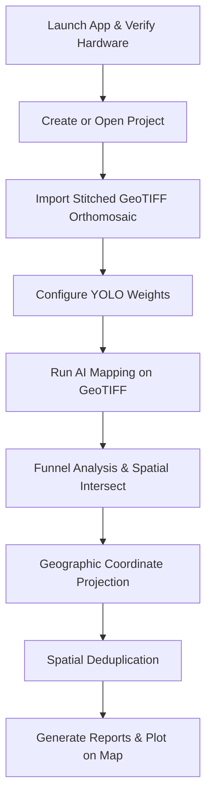

# Musa AI: System Overview, Objectives, Features, and Workflow

Musa AI is a PyQt6-based geospatial AI mapping platform designed for drone orthomosaic visualization, banana plantation monitoring, and automated plant disease detection. It offers a professional, project-first desktop GIS environment that leverages deep learning to count plants, map leaf boundaries, and localize diseases using high-resolution drone imagery.

---

## 1. Project Overview & Objectives

In large-scale banana cultivation, manually inspecting plantations for health and disease is highly labor-intensive, time-consuming, and prone to human error. Destructive diseases like **Panama Disease (Fusarium Wilt)** and **Black Sigatoka** can spread rapidly if not detected early. 

Drone orthomosaics—stitched high-resolution maps created from aerial drone imagery—provide a comprehensive view of plantations. However, manually scanning these massive maps is practically impossible. 

**Musa AI** solves this problem by automating orthomosaic visualization and applying a dual deep-learning model pipeline to recognize plants and pinpoint infections geographically.

### Objectives of the Project:
1. **Interactive GIS Visualization**: Provide a fast, responsive desktop interface to render massive geospatial drone orthomosaics (GeoTIFFs) smoothly without lag or high system memory overhead.
2. **Automated Banana Canopy Segmentation**: Recognize, segment, and count normal (full) and pruned (cut) banana leaves using deep-learning object segmentation models.
3. **Early Disease Detection & Localization**: Automate the detection and mapping of major banana plantation diseases (**Black Sigatoka** and **Panama Disease**) from aerial imagery.
4. **Geospatial Cross-Reference (The "Funnel" Concept)**: Intersect disease detections with individual plant canopies to determine which plants are healthy versus diseased.
5. **Actionable Precision Agriculture Reports**: Export precise geographic coordinates (Latitude, Longitude) and metadata for infected plants in agricultural-friendly formats (JSON, CSV, and Excel) to enable targeted herbicide or treatment application.

---

## 2. Key Features

Musa AI is designed with professional-grade agricultural workflows in mind, incorporating the following advanced features:

* **Project-First Workspace**: Organize plantation locations into distinct projects with unique database metadata (SQLite-backed). Settings, linked filepaths, and history are persisted locally.
* **Geospatial GeoTIFF Engine**: High-fidelity coordinates extraction and conversion using `rasterio` and `pyproj`. Reprojects drone orthomosaics from projected coordinate reference systems (e.g., UTM) to geodetic WGS84 for interactive mapping.
* **Multi-Level Image Pyramid Cache**: Dynamically scales and pre-tiles massive orthomosaics into multi-resolution PNG pyramids. This allows users to zoom and pan smoothly on Leaflet maps without loading multi-gigabyte files into RAM.
* **The YOLO AI Funnel**: Employs two deep-learning models (a leaf segmentation model and a disease object detector) in a spatial intersection funnel. By running a point-in-polygon algorithm, it automatically links specific diseases back to their host canopies.
* **Interactive Layer Manager**: Checkbox controls allow toggling orthomosaic visibility and specific detection layers (e.g., cut leaves, sigatoka points, healthy/diseased canopies) alongside live opacity sliders.
* **Integrated Hardware Acceleration**: Detects NVIDIA CUDA capabilities at startup and enables users to switch seamlessly between GPU and CPU processing.
* **Storage-Friendly Persistence Policy**: The database persists only paths and metadata, leaving huge original drone imagery, model weights, and GeoTIFFs untouched on the local filesystem. All generated analysis reports are saved to a dedicated, system-managed folder (`SystemOutput`).
* **Active Integrity Monitor**: A background thread checks the validity of local file paths every 5 seconds. If a GeoTIFF or AI model is moved or deleted on disk, the system automatically synchronizes the SQLite store to keep references clean.

---

## 3. How It Works: Step-by-Step Workflow

Below is the step-by-step workflow of Musa AI, mapping the journey from launching the application to producing precise agricultural maps and reports, detailed down to the core modules and subfunctions.

### Step 1: Initialization and Hardware Verification
When the application is launched, the core engine prepares the desktop shell and determines the processing capacity of the computer.
* **Module**: [app.py](file:///c:/Users/Eumelle/Desktop/github%20repo/Musa-AI-Desktop/banana_mapper/app.py) & [hardware.py](file:///c:/Users/Eumelle/Desktop/github%20repo/Musa-AI-Desktop/banana_mapper/hardware.py)
* **Workflow & Subfunctions**:
  1. `_configure_web_engine_gpu()`: Sets critical Chromium GPU flags for PyQt6's `QWebEngineView` to optimize canvas rendering.
  2. `detect_hardware()`: Queries the operating system to detect physical CPUs and compatible NVIDIA graphics cards via PyTorch (`torch.cuda.is_available()`).
  3. `_initial_processing_device_preference()`: Checks for saved preferences in SQLite. If a GPU is present, it defaults to GPU acceleration, otherwise failing over safely to CPU.

### Step 2: Session and Project Establishment
Users interact with the dashboard to create or open a project. Musa AI works under a project-first policy: you must select a project before performing any analysis.
* **Module**: [app.py](file:///c:/Users/Eumelle/Desktop/github%20repo/Musa-AI-Desktop/banana_mapper/app.py) & [database.py](file:///c:/Users/Eumelle/Desktop/github%20repo/Musa-AI-Desktop/banana_mapper/core/database.py)
* **Workflow & Subfunctions**:
  1. `create_project()` / `NewProjectDialog`: Generates a project entry in the local SQLite database.
  2. `_ensure_project_output_dir()`: Automatically builds a system-managed folder under `SystemOutput/<project-name>_<project-id>/` to hold all future reports.
  3. `open_project()`: Retrieves a unified `ProjectBundle`. If a GeoTIFF is already linked, it automatically triggers a background worker thread (`GeoTiffWorker`) to load it.
  4. `_recover_latest_analysis()`: Locates the latest generated JSON report in the output directory, reads and parses previous results, updates the visual counts, and immediately displays previously detected plants on the Leaflet map overlay upon launch.

### Step 3: Orthomosaic Parsing and Map Overlay Preparation
To display massive spatial GeoTIFFs inside the map engine, they must be converted into web-friendly, coordinate-accurate tiles. This is done inside a background thread so the user interface never freezes.
* **Module**: [geotiff.py](file:///c:/Users/Eumelle/Desktop/github%20repo/Musa-AI-Desktop/banana_mapper/geotiff.py) & [worker.py](file:///c:/Users/Eumelle/Desktop/github%20repo/Musa-AI-Desktop/banana_mapper/worker.py)
* **Workflow & Subfunctions**:
  1. **File Check**: `load_geotiff_for_leaflet()` verifies the file's physical existence and runs `_validate_dataset()` to guarantee that coordinate reference systems (CRS) and geotransform matrices exist.
  2. **CRS Transformation**: `_bounds_to_wgs84()` projects the spatial boundary limits from projected coordinates (like UTM zone projection systems) into WGS84 latitude/longitude using `rasterio.warp.transform_bounds()`.
  3. **Display Grid Calculation**: `_display_grid()` calculates the ideal output resolution based on the user's scale settings (100% Native, 75%, 50%, or 25%).
  4. **RGBA Reprojection**: `_reproject_to_rgba()` reads the spatial bands (RGB) and reprojects them into the output EPSG:4326 grid using bilinear resampling. It manages nodata pixels and assigns transparency via `_alpha_band()`.
  5. **Tiled Preview Pyramid**: `_save_preview_tiles()` downscales the reprojected preview sequentially and cuts it into `512x512` pixel directory tiles (`cols` x `rows`), writing them to the project's local geotiff cache.
  6. **Map Placement**: The main thread triggers `_send_overlay_to_map()`, which sends a JSON payload to the JavaScript bridge. The Leaflet map (`map_view.html`) instantiates a custom tile/image overlay, fitting the viewport directly to the boundary coordinates.

### Step 4: Configuring AI Weights
Before running analysis, the user links two AI models inside the project workspace or globally under the "Manage Models" dashboard utility.
* **Module**: [dialogs.py](file:///c:/Users/Eumelle/Desktop/github%20repo/Musa-AI-Desktop/banana_mapper/ui/dialogs.py) & [database.py](file:///c:/Users/Eumelle/Desktop/github%20repo/Musa-AI-Desktop/banana_mapper/core/database.py)
* **Workflow & Subfunctions**:
  1. **Leaf Geometry Weights**: Links to a YOLO segmentation model trained to isolate individual banana leaves (`full_leaf` or `cut_leaf`).
  2. **Disease Weights**: Links to a YOLO object detection model trained to isolate visual symptoms of `black_sigatoka` or `panama` disease.

### Step 5: High-Performance AI Funnel Execution
Once the user clicks "Run AI Mapping", the system executes a SAHI (Slicing Aided Hyper Inference) sliding window algorithm over the massive GeoTIFF to process it at the scale the models were originally trained on.
* **Module**: [detection.py](file:///c:/Users/Eumelle/Desktop/github%20repo/Musa-AI-Desktop/banana_mapper/detection.py) & [worker.py](file:///c:/Users/Eumelle/Desktop/github%20repo/Musa-AI-Desktop/banana_mapper/worker.py)
* **Workflow & Subfunctions**:
  1. **Model Loading**: `run_funnel_mapping_geotiff()` instantiates the two YOLO models in memory on the selected hardware processing device (CPU or GPU).
  2. **Tile Generation**: `_generate_tiles()` segments the vast orthomosaic dimensions into overlapping windows (default size `512x512` pixels with a `96` pixel overlap) to ensure no border objects are missed.
  3. **Overlapping Window Scanning**: The background thread reads the windowed region `dataset.read()`, scales pixels, and runs double inference:
     * `leaf_model.predict()`: Detects banana leaves and obtains polygon segment coordinates (`_parse_leaf_predictions()`).
     * `disease_model.predict()`: Detects diseases and obtains local center coordinates (`_parse_disease_predictions()`).
  4. **The Spatial Funnel Intersect**:
     * For every disease detection, the system identifies if its center point lies inside any leaf polygon by running a ray-casting point-in-polygon algorithm `_point_in_polygon()`.
     * If the disease falls within a leaf polygon boundary, that leaf segment's health is set to `diseased` and its ID is linked to the disease via `related_leaf_id`.
     * If a canopy polygon contains no diseases, it is automatically marked as `healthy`.
  5. **Georeferencing Projection**:
     * Centroid coordinates are mapped from local tile coordinates to the full GeoTIFF grid.
     * `_raster_pixel_to_wgs84()` projects those pixel coordinates into real-world geographic coordinates (Latitude/Longitude) by applying `rasterio`'s affine transformation matrix.
  6. **Interactive Scan Box**: During execution, the worker periodically sends coordinates to the Leaflet map bridge, rendering a moving scanning bounding box on the UI to represent progress visually.

### Step 6: Spatial Deduplication
Because the scanning windows overlap, the same leaf or disease may be scanned multiple times at different crop borders. A spatial deduplication algorithm merges these redundant records.
* **Module**: [detection.py](file:///c:/Users/Eumelle/Desktop/github%20repo/Musa-AI-Desktop/banana_mapper/detection.py)
* **Workflow & Subfunctions**:
  1. `dedupe_records()`: Buckets coordinate entries using spatial indices.
  2. `haversine_m()`: Calculates the distance in meters between close-proximity points on the Earth's surface.
  3. **Detections Merge**: If two points of the same class land within a distance radius of `duplicate_distance_m` (default: 0.5 meters), the duplicate points are merged. The algorithm averages the coordinates, maintains the maximum confidence score, and increments `duplicate_count`.

### Step 7: Exporting Reports and Displaying Detections
Once the background thread finishes processing, results are exported to the project's managed output directory and displayed visually on the map.
* **Module**: [detection.py](file:///c:/Users/Eumelle/Desktop/github%20repo/Musa-AI-Desktop/banana_mapper/detection.py) & [app.py](file:///c:/Users/Eumelle/Desktop/github%20repo/Musa-AI-Desktop/banana_mapper/app.py)
* **Workflow & Subfunctions**:
  1. `save_mapping_outputs()`: Exports three structured files to the project's managed output folder:
     * **JSON** (`.json`): Contains raw coordinates, confidence values, pixel positions, and health status for immediate map recovery.
     * **CSV** (`.csv`): Stores results in standard tabular fields.
     * **Excel** (`.xlsx`): Generated by `_write_xlsx()` and `_worksheet_xml()` by writing compressed XML packages directly (no heavy third-party dependencies required).
  2. `save_analysis_result()`: Stores references to these report files inside the local SQLite database.
  3. `_send_detections_to_map()` / `setDetectionData()` (JS/HTML): Renders Leaflet markers, interactive tooltips, and cluster layers on the map canvas. Detections are styled dynamically according to the chosen application theme (Light, Dark, Slate, Emerald, etc.).

---

## 4. Local Database & Integrity Policy

To maintain lightweight, robust, and portable filesystems, Musa AI adheres to strict data policies:

1. **Path-Only Persistence**: The local SQLite database (`.banana_mapper/banana_mapper.sqlite3`) strictly stores metadata, preferences, and filepaths. It never stores heavy image binaries, GeoTIFF pixels, or AI model weights, preventing database bloating.
2. **Periodic Integrity Checks**: 
   * **Module**: `_sync_current_project_integrity()` (running on a `QTimer` loop every 5 seconds).
   * **Functionality**: Loops through all project assets, AI models, and analysis reports linked in SQLite. If a user deletes, renames, or moves a file on their computer, the database automatically cleans itself up by removing the invalid record. 
   * If a GeoTIFF is deleted, it safely clears the overlay from the map. If analysis files are missing, it resets the layer count indicators on the workspace panel dynamically and logs the synchronization event in the UI console log.
3. **Managed Isolation**: Reusable GeoTIFF preview cache tiles are saved in an isolated subfolder inside each project's managed directory rather than in a shared application cache, keeping projects isolated and highly portable.
